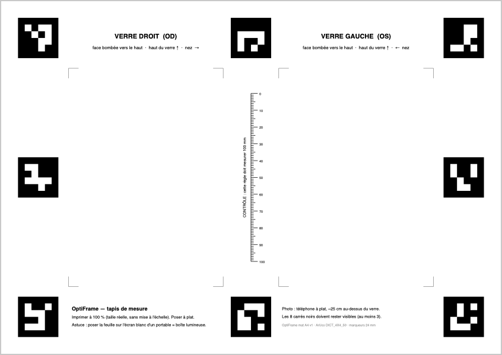
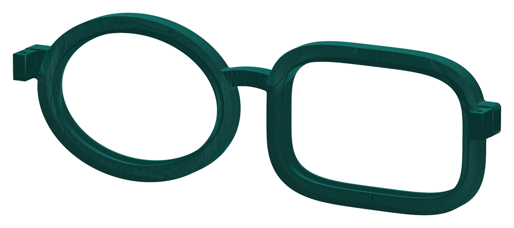

# OptiFrame — des verres recyclés à la monture imprimée en 3D

Web app mobile (défi CodeML × Santé Numérique Sans Frontières) : on photographie un verre de lunettes
recyclé posé sur un tapis imprimé, l’app mesure son contour au dixième de millimètre et génère une
monture sur mesure **prête à imprimer en 3D**, même quand le verre gauche et le verre droit n’ont pas
la même forme.

**➡️ App : https://m-azaiez.github.io/OptiFrame/** · aucun compte, aucune installation, fonctionne hors ligne après la 1re ouverture.

<p align="center"></p>

| Palier | Statut | Où |
|---|---|---|
| 1 · Mesurer (photo → repères → vue de dessus → contour → A, B, périmètre + image de contrôle) | ✅ | onglet **Mesurer** |
| 2 · IA (U-Net entraîné sur données synthétiques, exécuté dans le navigateur) | ✅ | `ml/`, onglet **Pas à pas** |
| 3 · Monture paramétrique (2 contours différents, pont, tenons) + aperçu 3D + STL | ✅ | onglet **Monture** |
| 4 · Valider (superposition contour/rainure, écart entre prises, pied à coulisse) | ✅ | onglet **Valider** |

---

## 1. Tester en 30 secondes

1. Scanner le QR code (Chrome Android ou Safari iOS).
2. Pas de tapis sous la main ? **« Essayer avec une photo d’exemple »** lance tout le traitement sur une photo de démonstration (synthétique).
3. Avec le kit : imprimer le [tapis A4](public/mat/optiframe-mat-A4.pdf), poser les verres, **Photographier**.
4. Onglet **Monture** → **Télécharger monture.stl**. Onglet **Mesurer** → **Contours SVG 1:1** (à imprimer pour poser le verre sur son tracé).

## 2. Dispositif de capture (remontable en moins d’une minute)



- **Une feuille A4 imprimée à 100 %** ([PDF](public/mat/optiframe-mat-A4.pdf)) : 8 marqueurs ArUco (`DICT_4X4_50`, 24 mm) autour de deux zones,
  **OD** (verre droit, à gauche comme sur des lunettes vues de face) et **OS** (verre gauche). Une **règle de 100 mm** permet de vérifier l’échelle d’impression ;
  si l’imprimante a réduit la page, on saisit la longueur réelle dans *Aide → Réglages* et toutes les mesures sont corrigées.
- **Le verre est posé face bombée vers le haut** : son bord touche le papier, il est donc dans le plan des marqueurs (pas d’erreur d’échelle).
  Le bord reste un peu au-dessus du papier : l’app corrige cette **parallaxe** à partir de la position de la caméra retrouvée par l’homographie.
- **Boîte lumineuse (optionnel, recommandé)** : poser le tapis sur l’écran d’un portable affichant du blanc (bouton *Boîte lumineuse* dans l’app). Le papier devient translucide, le bord du verre ressort en noir très net.
- **Une seule photo peut mesurer les deux verres** (zones OD + OS), téléphone à plat à ~25 cm. Au moins 3 repères suffisent : on peut aussi cadrer une seule zone, de plus près.

## 3. Comment ça marche

Tout le traitement tourne **dans le navigateur** (Web Workers, WebAssembly) : pas de serveur, les photos ne quittent pas le téléphone.

```
photo ─► 1. Repères ArUco ─► 2. Homographie ─► 3. Vue de dessus ─► 4. Segmentation IA ─► 5. Contour sub-pixel ─► mesures
          OpenCV.js +         mm ↔ px,          6 px/mm (contrôle)   U-Net, ONNX Runtime    recalage sur la photo     A, B, périmètre,
          affinage maison     32 coins, RANSAC   3 px/mm (IA)         Web (wasm)             d'origine + parallaxe     ED, SVG 1:1
                                                                                                    │
                                                    monture.stl ◄─ 6. CAO paramétrique (manifold-3d) ◄┘
```

1. **Repères** — OpenCV.js détecte les marqueurs sur une copie réduite (rapide), puis chaque coin est **ré-estimé en pleine résolution
   en ajustant une droite sur les 4 bords de chaque marqueur** (~30 profils de gradient sub-pixel par bord, rejet des aberrants), puis intersection.
   Utiliser des bords entiers plutôt que des pixels de coin rend l’homographie bien plus stable. La largeur de transition des bords donne une **mesure de netteté en mm**.
2. **Homographie** — jusqu’à 32 correspondances mm ↔ px, RANSAC puis moindres carrés. Indicateurs affichés : erreur de reprojection (typiquement < 0,02 mm), résolution (px/mm), inclinaison et hauteur de la caméra.
3. **Redressement** — chaque zone visible est ré-échantillonnée en vue de dessus (anti-crénelage par réduction préalable), à 6 px/mm pour l’image de contrôle et 3 px/mm pour l’IA.
4. **Segmentation** — un U-Net (0,5 M paramètres) donne une carte de probabilité « verre ». Repli automatique sur une segmentation classique (normalisation de l’éclairage + Canny + remplissage) si le modèle n’est pas chargé.
5. **Contour** — iso-ligne 0,5 sub-pixel de la carte, puis **recalage sur le bord réel dans la photo d’origine** : chaque point est déplacé le long de sa normale vers le pic de gradient « bord sombre → papier », échantillonné directement dans la photo pleine résolution via l’homographie (aucune perte de ré-échantillonnage). Filtre médian + lissage de Fourier (60 harmoniques), puis correction de parallaxe, d’échelle d’impression et d’un biais calibrable.
6. **Mesures (système boxing, ISO 8624)** — A, B, périmètre, diamètre effectif. Un verre posé de travers est redressé (rectangle d’encadrement minimal, ±8°).

## 4. Données et IA

> Détails, commandes et courbes : [`ml/README.md`](ml/README.md).

**Le problème** : un verre est transparent ; reflets, ombres, traitements anti-reflet colorés et bords peu contrastés font échouer le seuillage classique.
Aucun jeu de données n’existe pour « un verre de lunettes posé sur un tapis vu de dessus ». **Nous l’avons fabriqué.**

**Idée clé : entraîner dans le domaine redressé.** L’app redresse toujours la zone du tapis en vue de dessus à 3 px/mm avant la segmentation.
Le modèle ne voit donc jamais de perspective ni d’échelle variable : seulement du papier, les marques imprimées du tapis et un verre.
Ce domaine très contraint est **simulable de façon réaliste** — chaque image d’entraînement est rendue à partir du vrai fichier du tapis.

**Générateur synthétique** ([`ml/lenssynth.py`](ml/lenssynth.py), [`ml/dataset.py`](ml/dataset.py)) — chaque échantillon est entièrement déterminé par sa graine (jeu reproductible, illimité, 60 ms/image) :
- **formes** : superellipses, séries de Fourier, aviateur, œil-de-chat, pantos, rond, hexagonal/octogonal (A de 33 à 64 mm) ;
- **optique** : réfraction (minification/grossissement du papier et des marques), transmission et teintes (verres clairs, anti-reflet, solaires) ;
- **le bord vu de dessus** : bande sombre de largeur et contraste variables, reflets brillants, **segments où le bord disparaît presque** ;
- **pièges** : « anneau myopique » à l’intérieur des verres épais, ombre décalée du bord, ombre du téléphone, reflets de fenêtre et du téléphone, voiles colorés d’anti-reflet, points d’encre du frontofocomètre, trous de perçage, poussières ;
- **éclairage et caméra** : mode boîte lumineuse / lumière ambiante, gradients, flou, bruit, gamma, balance des blancs, JPEG.


**Modèle** ([`ml/train.py`](ml/train.py)) — U-Net à convolutions 3×3 (12→96 canaux, 5 niveaux), 516 k paramètres, ~2 GMAC par zone, entièrement convolutif.
Perte : entropie croisée pondérée ×5 près du bord + Dice, étiquettes douces anti-crénelées (le bord à 0,5 tombe exactement sur le vrai contour).
AdamW + OneCycle, 14 000 itérations × 16 images (224 000 images vues), GPU Apple M4 (MPS), ~2 h. Export ONNX (2 Mo), exécution par ONNX Runtime Web (wasm SIMD) : ~0,3 s par zone sur un M4.

**Évaluation de bout en bout** ([`bench/run.ts`](bench/run.ts)) — le *même code TypeScript que l’app* est exécuté sous Node sur 24 photos de téléphone simulées
([`ml/make_photos.py`](ml/make_photos.py) : 36 verres, inclinaison 0–28°, téléphone tourné, table autour du tapis, défocalisation, bruit, JPEG), dont le contour exact est connu :

| Méthode | Verres trouvés | Erreur moy. A et B | ≤ 1 mm | lumière ambiante | boîte lumineuse |
|---|---|---|---|---|---|
| Classique (sans IA) + affinage | 29 / 36 | 1,59 mm | 67 % | 2,08 mm | 0,03 mm |
| **IA + affinage** | **36 / 36** | **RESULT_AI mm** | **RESULT_PCT** | RESULT_AMB mm | RESULT_BACK mm |

**Vérité terrain réelle** : protocole pour vos propres verres — saisir les cotes au pied à coulisse (système boxing) dans *Valider*, l’app calcule l’erreur, exporte un CSV et peut **calibrer automatiquement le biais du contour** (*Aide → Calibrer*).

**Sources et licences** : aucune donnée personnelle, aucune image tierce — 100 % des images d’entraînement sont générées par nos scripts (licence MIT du dépôt).
Pas de modèle pré-entraîné (Segment Anything a été envisagé, mais ses ~40 Mo et plusieurs secondes par image sur téléphone ne tiennent pas le budget de 30 s et le mode hors ligne).

## 5. La monture



Générée par [`src/frame/frame.ts`](src/frame/frame.ts) avec **manifold-3d**, une bibliothèque qui garantit un maillage fermé (STL valide). Le module est vérifié par un test automatique : `npm run test`.

- **Chaque cercle épouse son verre** : le contour mesuré est décalé vers l’extérieur (largeur du cercle, 4 mm par défaut). Les deux verres peuvent avoir des formes différentes. S’il en manque un, l’autre est utilisé en miroir.
- **Rainure en V à 45°** pour le clipsage, avec un jeu de 0,2 mm au fond (réglable de 0 à 0,5 mm). Une lèvre avant de 0,8 mm retient le verre et une lèvre arrière de 0,4 mm le clipse. Les parois à 45° **s’impriment sans supports**, face avant sur le plateau.
- **Pont** en arche réglable (18 mm par défaut, norme DBL), avec les centres de boxing alignés sur la ligne de référence.
- **Tenons des branches** avec un bloc de charnière. Le trou de l’axe est **en goutte d’eau** pour s’imprimer sans support ; un morceau de filament de 1,75 mm sert d’axe.
- **Contrôles sur le maillage final** : arêtes libres, genre topologique, volume, masse. L’app découpe la monture générée au niveau de la rainure et mesure l’écart réel avec le contour du verre (onglet Valider). Valeur obtenue : 0,200 mm pour une consigne de 0,2.

## 6. Exigences du format

| Exigence | Réalisation |
|---|---|
| HTTPS + QR code | GitHub Pages ([workflow](.github/workflows/deploy.yml)) ; QR code dans l’app (*Aide*) et ci-dessus |
| Aucune installation, compte ou clé | Site statique, PWA installable en option |
| Mobile d’abord, utilisable à une main | Barre d’onglets en bas, gros boutons, testé à 375 px de large |
| Caméra intégrée + import en repli | `getUserMedia` avec guidage en direct (repères détectés, zone visible, inclinaison), `ImageCapture.takePhoto()` en pleine résolution sur Android, sinon import de fichier |
| Traitement dans le navigateur | OpenCV.js + ONNX Runtime Web dans un Worker, CAO dans un second Worker, cache hors ligne (service worker) |
| Moins de 30 s par paire | ~1,6 à 2 s pour une photo de la paire sur un M4 |
| Export du contour en SVG 1:1 | `contours-1-1.svg` (A4, règle de contrôle de 50 mm) |
| Messages clairs | Tapis absent, repères insuffisants, photo floue, feuille non plane, photo trop inclinée, zone hors cadre, verre absent, verre au bord, contour incertain : chaque message est accompagné d’un conseil |

## 7. Limites connues (honnêtement)

- **Modèle entraîné uniquement sur des images synthétiques.** Les photos réelles peuvent présenter des effets non simulés. Le banc d’essai mesure la précision sur des photos synthétiques : il faut **valider sur de vrais verres au pied à coulisse** (protocole intégré à l’app) et compléter avec des photos réelles annotées (voir `ml/README.md`, « capture appariée »).
- **L’échelle dépend de l’impression du tapis.** Contrôler la règle de 100 mm (correction possible dans l’app).
- **Hauteur du bord pour la parallaxe** : la valeur par défaut est de 1 mm. Une erreur de 1 mm sur cette hauteur produit environ 0,1 à 0,2 mm d’erreur sur A.
- **Orientation du verre** : A et B dépendent de l’orientation horizontale du verre. Il faut poser le verre droit ; l’app ne corrige que ±8°.
- **Lunettes complètes (verres montés)** : non prises en charge, la monture surélève les verres. Il faut des verres démontés.
- **Monture** : les branches ne sont pas générées, seulement les tenons. Le clipsage dépend du matériau : en PLA rigide, réduire la lèvre arrière ou passer en PETG.
- **Sans IA** (modèle non chargé), la segmentation classique n’est fiable qu’avec la boîte lumineuse.

## 8. Lancer en local

```bash
npm install
npm run dev          # http://localhost:5173 (caméra : utiliser l'import de fichier, ou HTTPS)
npm run test         # génère une monture test et vérifie maillage fermé + rainure
npm run bench        # précision de bout en bout sur bench/photos (après ml/make_photos.py)
npm run build        # site statique dans dist/
```

Partie IA (Python 3.11+) :

```bash
cd ml && python -m venv .venv && .venv/bin/pip install -r requirements.txt
.venv/bin/python gen_mat.py                 # tapis PDF/SVG + rendus raster
.venv/bin/python dataset.py 16              # aperçu des données synthétiques
.venv/bin/python train.py --out runs/v1     # entraînement (MPS / CUDA / CPU)
.venv/bin/python export_onnx.py runs/v1/best.pt ../public/models/lens_seg.onnx
.venv/bin/python make_photos.py --n 24 --out ../bench/photos
```

## 9. Structure

```
src/core/      géométrie, homographie et pose caméra, mesures boxing, fusion de prises
src/vision/    pipeline (ArUco, redressement, segmentation, contour, affinage), worker, messages
src/frame/     CAO de la monture (manifold-3d), export STL, worker
src/ui/        interface Preact (caméra, onglets), dessins de contrôle
src/export/    SVG 1:1
ml/            tapis, générateur synthétique, entraînement, export ONNX, photos de test
bench/         banc d'essai de bout en bout (Node) et test de la monture
shared/        géométrie du tapis (partagée par Python et TypeScript)
```

## 10. Licences et outils

- Code du projet : **MIT**. Données d’entraînement : générées par nos scripts (MIT).
- [OpenCV.js](https://opencv.org) 4.9 (Apache 2.0) · [ONNX Runtime Web](https://onnxruntime.ai) (MIT) · [manifold-3d](https://github.com/elalish/manifold) (Apache 2.0) · [three.js](https://threejs.org) (MIT) · [Preact](https://preactjs.com) (MIT) · [qrcode](https://github.com/soldair/node-qrcode) (MIT) · [Vite](https://vite.dev) + vite-plugin-pwa (MIT).
- Entraînement : [PyTorch](https://pytorch.org) (BSD-3), opencv-python (Apache 2.0 / MIT), NumPy (BSD), ReportLab (BSD) pour le PDF du tapis.
- **Outils d’IA utilisés** : Claude Code (Anthropic, modèle Claude Opus) comme assistant de programmation pour l’architecture, le code, le générateur de données et la rédaction. Toutes les mesures citées proviennent des scripts du dépôt et sont reproductibles.
