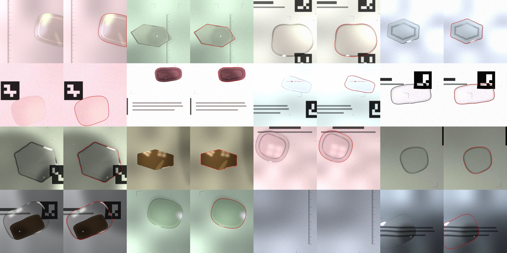

# Dossier « données et IA »

Objectif : isoler un verre de lunettes **transparent** dans une photo de téléphone, de façon assez fiable pour mesurer
sa largeur A et sa hauteur B à moins de 1 mm, malgré les reflets, les ombres et un bord souvent à peine visible.

## 1. Pourquoi des données synthétiques ?

Aucun jeu public ne montre « un verre de lunettes démonté, posé à plat, vu de dessus ». Les jeux d’objets transparents
(Trans10K, ClearGrasp…) montrent des verres à boire et des bouteilles, en perspective, avec des licences souvent non commerciales.
Ils ne correspondent ni au domaine ni à la précision voulue (sub-millimétrique).

**Le domaine redressé.** L’app commence par repérer les marqueurs ArUco du tapis, puis redresse chaque zone en vue de
dessus à 3 px/mm. Le réseau ne voit donc jamais de perspective ni d’échelle variable : seulement le papier, les marques
imprimées du tapis (coins, règle, textes, bords de marqueurs) et un verre. On peut simuler ce domaine très fidèlement, car on
part du **fichier exact du tapis** ([`gen_mat.py`](gen_mat.py) produit à la fois le PDF imprimé et les rendus utilisés pour l’entraînement).

## 2. Le générateur ([`lenssynth.py`](lenssynth.py), [`dataset.py`](dataset.py))

Chaque échantillon 256 × 256 px (85 × 85 mm) est rendu à 6 px/mm puis réduit à 3 px/mm (étiquettes douces anti-crénelées).
**Une graine entière détermine entièrement une image** : le jeu est illimité, reproductible, et ne contient aucune donnée personnelle.

| Famille | Ce qui est simulé (tirages aléatoires) |
|---|---|
| Formes | superellipse (p 2–5,5), Fourier, aviateur, œil-de-chat, pantos, rond, hexagone/octogone arrondi ; A 33–64 mm, B/A 0,48–1 ; rotation ±25°, miroir |
| Papier et lumière | teinte du papier, encre 4–25 % de gris, gradients et champ d’éclairage, vignettage, texture du papier, **ombre du téléphone** (35 %), **mode boîte lumineuse** (35 %) |
| Optique du verre | réfraction (grandissement 0,82–1,18 et distorsion lisse), transmission 85–99,5 %, **verres solaires teintés** (10 %) |
| Bord vu de dessus | bande sombre de 0,25 à 2,6 mm, contraste variable le long du contour, profils uniforme, dégradé ou ligne ; **segments où le bord disparaît** (30 %) ; liseré brillant interne ; reflets ponctuels |
| Pièges | **anneau myopique** interne (35 %), **ombre décalée du bord** (40 % en lumière ambiante), reflets en taches, de fenêtre ou du téléphone (sombre avec un point brillant), voile coloré d’anti-reflet (vert, violet, bleu, or), points et traits d’encre du frontofocomètre (25 %), trous de perçage (6 %), poussières, cheveux |
| Composition | 1 verre (86 %), 2 verres dont un partiellement hors champ (8 %), aucun verre (6 %, apprend à ne rien détecter) ; erreur d’échelle résiduelle ±6 % |
| Caméra | flou gaussien et de bougé, bruit dépendant du signal, gamma 0,8–1,25, balance des blancs, JPEG q45–95 |

*Aperçu (`python dataset.py 16`) : image rendue à gauche, contour de vérité terrain en rouge à droite.*

## 3. Le modèle ([`train.py`](train.py))

- **U-Net à convolutions 3×3** : canaux 12, 24, 32, 48, 64, 96, 5 sous-échantillonnages, décodeur avec connexions de saut et suréchantillonnage bilinéaire, 516 k paramètres, ~2 GMAC pour une zone de 416 × 288 px.
- **Pourquoi des convolutions classiques et pas « depthwise »** : une première version MobileNet-like (280 k paramètres) prenait 557 ms par itération sur le GPU Apple (MPS), contre 225 ms pour cette version. ONNX Runtime Web exécute aussi très bien les convolutions denses en wasm SIMD.
- **Entièrement convolutif** : entraîné sur des recadrages 256 × 256, appliqué tel quel à une zone complète de 96 × 134 mm.
- La normalisation est intégrée au graphe : l’app envoie du RGB dans [0, 1].

**Entraînement** : perte = entropie croisée pondérée ×5 à moins de 1,5 mm du bord + 0,5 × Dice. AdamW (lr 2e-3, wd 1e-4), OneCycle,
6 000 itérations puis reprise de 5 000 itérations (lr 1e-3 décroissant) × 16 images, flux infini, validation sur 512 images fixes (graines 10 000 000+).
Matériel : Apple M4 (MPS), environ 2 h. Données générées en parallèle par 9 processus.

**Export** ([`export_onnx.py`](export_onnx.py)) : ONNX opset 17, hauteur et largeur dynamiques, 2 Mo. Écart maximal PyTorch ↔ onnxruntime : 7·10⁻⁶.
**Inférence** : ONNX Runtime Web (wasm), ~0,25 à 0,3 s par zone sur un M4 (mono-fil). Le modèle et le moteur sont mis en cache pour le mode hors ligne.

## 4. IA + géométrie : le contour final

Le réseau donne une carte de probabilité robuste mais à 0,33 mm/px. Pour atteindre la précision visée :
1. **iso-ligne 0,5 sub-pixel** de la carte : les étiquettes douces placent le 0,5 sur le vrai bord ;
2. **recalage sur la photo d’origine** : le long de chaque normale, on échantillonne la photo pleine résolution (via l’homographie, sans ré-échantillonnage) et on se cale sur le pic de gradient « bord sombre → papier » le plus proche (pondération gaussienne de 0,45 mm autour du contour IA, filtre médian, lissage) ;
3. corrections physiques : parallaxe du bord (hauteur caméra estimée), échelle d’impression, biais calibré.

L’IA apporte la **robustesse** (savoir où est le verre malgré les pièges), la géométrie apporte la **précision** (sub-pixel sur l’image native).

## 5. Évaluation

**Validation segmentation** (512 images synthétiques) : voir `runs/v1/log.json` (IoU, erreur A/B au pixel près).

**Bout en bout** ([`../bench/run.ts`](../bench/run.ts)) : le code TypeScript de l’app est exécuté sous Node sur 24 photos de téléphone
simulées ([`make_photos.py`](make_photos.py)). Ces photos comptent 36 verres, des inclinaisons de 0 à 28°, un téléphone tourné, la table
visible autour du tapis, de la défocalisation, du bruit et de la compression JPEG. A et B sont mesurés par la même procédure sur le contour trouvé et sur le contour vrai.

| Référence · méthode | Verres trouvés | Erreur moy. A et B | ≤ 1 mm | lumière ambiante | boîte lumineuse |
|---|---|---|---|---|---|
| Tapis · classique (sans IA) | 29 / 34 | 1,86 mm | 68 % | 2,24 mm | 0,06 mm |
| Tapis · IA sans affinage | 34 / 34 | 0,21 mm | 100 % | 0,21 mm | 0,22 mm |
| **Tapis · IA + affinage** | **34 / 34** | **0,16 mm** | **100 %** | 0,19 mm | 0,07 mm |
| **Feuille Lettre · IA + affinage** | **23 / 23** | **0,17 mm** | 96 % | 0,17 mm | — |
| **Feuille A4 · IA + affinage** | 11 / 12 | **0,16 mm** | 92 % | 0,16 mm | — |

Résolution caméra navigateur (1920 × 1440, tapis) : 0,29 mm, 93 % ≤ 1 mm. Photos de test reproductibles : `python make_photos.py [--sheet letter|a4] [--res 1920x1440]`.

## 6. Passer aux vraies photos : la « capture appariée »

La limite principale est l’écart entre synthétique et réel. Pour annoter de vraies photos difficiles **sans annotation manuelle** :
1. poser un verre sur le tapis, sur la **boîte lumineuse** : le bord est noir et net, la segmentation (même classique) est quasi parfaite ;
2. **sans bouger le verre**, éteindre l’écran et reprendre des photos en lumière de la pièce, avec reflets, sous un autre angle ;
3. comme toutes les photos sont redressées dans les coordonnées du tapis (en mm), **le masque de la photo facile s’applique exactement aux photos difficiles**.

On obtient en quelques minutes des dizaines d’exemples réels annotés, prêts pour affiner le modèle (`train.py --resume runs/v1/best.pt`, avec un mélange d’images réelles et synthétiques).
Les photos de l’évaluation finale ne sont jamais utilisées pour l’entraînement.

## 7. Licences

- Images d’entraînement : 100 % générées par nos scripts (MIT). Aucune image de visage, de nom ni d’ordonnance.
- Pas de poids pré-entraînés : le modèle est entraîné de zéro.
- Outils : PyTorch (BSD-3), OpenCV (Apache 2.0), NumPy (BSD), ONNX / onnxruntime (Apache 2.0 / MIT), ReportLab (BSD), Matplotlib (PSF).
